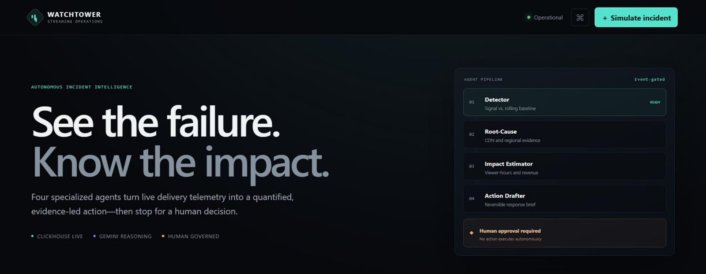
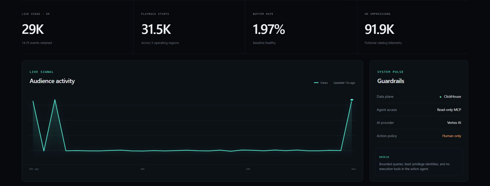
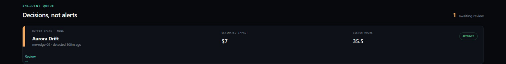
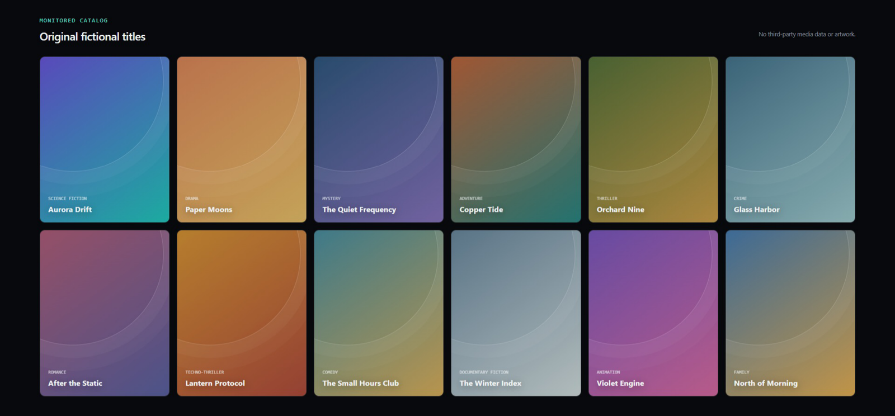
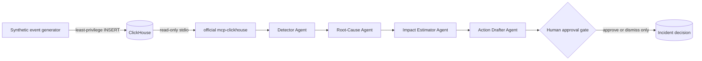

# WatchTower

WatchTower is human-governed incident intelligence for streaming operations. It watches live,
synthetic delivery telemetry in ClickHouse, detects material deviations, investigates the likely
cause, quantifies viewer and revenue impact, and drafts a reversible response for a person to
approve or dismiss.

Built from scratch for **Agentic Cinema: The Blockbuster Hackathon — ClickHouse Track**.

**Live application:** <https://watchtower-283557821298.us-central1.run.app>

The dashboard is open to everyone. Injecting an anomaly, advancing the loop, and approving or
dismissing an incident require the operator token, so the human decision boundary holds in public.
The service scales to zero, so the first request after an idle period takes roughly 30 seconds while
readiness reports `503`.

> WatchTower never executes an operational recommendation. Approval records a human decision; it
> does not call a CDN, ad platform, playback system, or other downstream service.



Four specialized agents turn live delivery telemetry into a quantified, evidence-led action — then
stop for a human decision. The pipeline is event-gated: Gemini is not called on every tick.



Every reading comes from ClickHouse. Agents reach the data only through the official read-only
`mcp-clickhouse` server, and the action agent has no execution tool of any kind.



An incident is a decision, not an alert. Each one carries a root cause traced to a specific CDN node,
an estimated dollar impact, and lost viewer-hours — and waits for a person.



All twelve titles, descriptions, and covers are original and fictional. The artwork is generated from
CSS gradients in code — there is no third-party media data, poster art, or external image request
anywhere in the product.

## Why it is different

- **Continuous, not conversational:** monitoring runs as an event-gated operations loop.
- **Evidence before prose:** anomaly detection and impact math are deterministic and auditable.
- **Real partner path:** analytics queries execute through the official `mcp-clickhouse` server.
- **Four real ADK agents:** Detector → Root-Cause → Impact Estimator → Action Drafter.
- **Quantified impact:** every incident includes viewer-hours, affected sessions, and USD impact.
- **Human control:** the action agent has no execution tools; every brief waits for a decision.
- **Original media data:** all 12 titles, descriptions, telemetry, and gradient covers are fictional.

## Runtime architecture



The ingestion identity can `SELECT` and `INSERT` only. The separate MCP identity can `SELECT` only.
The in-process MCP middleware additionally blocks mutations, comments, multiple statements,
unbounded results, and access outside the WatchTower tables. MCP uses stdio inside the container and
is never exposed to the network.

See [the architecture and trust model](docs/ARCHITECTURE.md) for the full operating sequence.

## Quick start: self-contained Docker demo

Prerequisites: Git, Docker Desktop, and Docker Compose v2.

```bash
git clone https://github.com/ZiyadAzzaz/watchtower-agentic-cinema.git
cd watchtower-agentic-cinema
docker compose up --build -d
docker compose ps
```

Open <http://localhost:8080> after both containers are healthy. The stack creates a local ClickHouse
service, two scoped database users, the schema, historical baseline, and the application. No `.env`
file or cloud account is required for this path.

Open the top-right demo access settings and save `local-demo-only` before injecting an incident or
recording a decision. This value is strictly for the loopback-only local stack. Production uses an
independent random operator token from Secret Manager.

The self-contained Docker container deliberately does not inherit host Google credentials. It
exercises the real local data, detection, impact, dashboard, and approval path; development mode
clearly falls back if Gemini is unavailable. Use the next section for real Vertex AI execution.

Stop containers while preserving the local database volume:

```bash
docker compose stop
```

Run `docker compose down -v` only when you intentionally want to delete all local WatchTower data.

## Python development with real Gemini

WatchTower supports Python 3.12 and 3.13. These commands use the project environment name from the
reference development setup:

```powershell
conda create -n watch-tower python=3.12 -y
conda activate watch-tower
python -m pip install -e '.[dev]'
docker compose up -d clickhouse
Copy-Item .env.example .env
```

Set the following non-production values in the Git-ignored `.env`:

```dotenv
WATCHTOWER_ENV=development
WATCHTOWER_BOOTSTRAP_SCHEMA=false
WATCHTOWER_ADMIN_TOKEN=local-demo-only
CLICKHOUSE_HOST=localhost
CLICKHOUSE_PORT=8123
CLICKHOUSE_DATABASE=watchtower
CLICKHOUSE_USER=watchtower_app
CLICKHOUSE_PASSWORD=local-app-only
CLICKHOUSE_MCP_USER=watchtower_mcp
CLICKHOUSE_MCP_PASSWORD=local-mcp-only
CLICKHOUSE_SECURE=false
CLICKHOUSE_VERIFY=false
```

Authenticate to a project where you are authorized to use Vertex AI. The competition deployment
uses `watchtower-507216`; an external contributor may use their own Vertex-enabled project in
development mode.

```powershell
gcloud auth application-default login
gcloud auth application-default set-quota-project YOUR_VERTEX_PROJECT_ID
python -m uvicorn watchtower.api:app --host 127.0.0.1 --port 8080
```

Also set `GOOGLE_CLOUD_PROJECT=YOUR_VERTEX_PROJECT_ID`, `GOOGLE_CLOUD_LOCATION=us-central1`, and
`GOOGLE_GENAI_USE_VERTEXAI=true` in `.env`. Never commit `.env` or paste credentials into an issue.

## ClickHouse Cloud bootstrap

This is an administrator-only, one-time operation. Place a rotated temporary administrator
credential and the TLS endpoint in the Git-ignored `.env`, then run:

```powershell
conda activate watch-tower
python scripts/bootstrap_clickhouse_cloud.py
python scripts/verify_clickhouse_cloud.py
python scripts/verify_vertex_gemini.py
```

The bootstrap creates the WatchTower schema, inserts the fictional catalog, generates independent
`watchtower_app` and `watchtower_mcp` credentials, limits their grants, and replaces the temporary
administrator credential in `.env`. It never prints a secret. Verification uses unique synthetic
scopes and does not delete cloud data.

## Verification

```bash
python -m ruff format --check watchtower tests scripts
python -m ruff check watchtower tests scripts
python -m pytest --cov=watchtower --cov-report=term-missing
```

Expect **46 passed, 1 deselected**. The deselected test needs Docker and runs against a real
ClickHouse instance and the real `mcp-clickhouse` server:

```bash
docker compose up -d --wait clickhouse
python -m pytest tests/test_clickhouse_integration.py -m integration -vv
```

`tests/test_production_contract.py` pins every defect that once reached a live Cloud Run revision,
and asserts that no execution tool exists anywhere in the runtime.

**[docs/TESTING.md](docs/TESTING.md) is the full guide** — five levels, from a five-second lint to
verifying the human approval boundary against the public deployment, with what each one proves.

## Configuration

| Variable | Purpose | Production rule |
|---|---|---|
| `GOOGLE_CLOUD_PROJECT` | Vertex AI project | Must equal `watchtower-507216` |
| `GOOGLE_CLOUD_LOCATION` | Vertex AI and Cloud Run region | `us-central1` by default |
| `GOOGLE_GENAI_USE_VERTEXAI` | Selects Vertex AI | Must be `true` |
| `WATCHTOWER_AGENT_MODEL` | ADK Gemini model | `gemini-2.5-flash` |
| `WATCHTOWER_ADMIN_TOKEN` | Protects injection and decisions | Required; Secret Manager only |
| `WATCHTOWER_BOOTSTRAP_SCHEMA` | Allows schema creation | Must be `false` in production |
| `CLICKHOUSE_USER/PASSWORD` | Ingestion and incident identity | Scoped `SELECT, INSERT` |
| `CLICKHOUSE_MCP_USER/PASSWORD` | Official MCP identity | Scoped `SELECT` only |
| `CLICKHOUSE_SECURE/VERIFY` | Database transport security | Both must be `true` |

No secret belongs in the repository, container image, command output, or Cloud Run environment as
plain text.

## Cloud Run production profile

The guarded deployment profile is deliberately cost-constrained:

- fixed project `watchtower-507216` and region `us-central1`;
- private by default; public release requires a separate switch and approval;
- request-based billing with minimum instances `0`;
- maximum instances `1`, concurrency `20`;
- 1 vCPU, 512 MiB memory, and a 120-second request timeout;
- credentials supplied from Secret Manager;
- dedicated runtime service account with Vertex AI User and access to only three named secrets.

Production validation refuses another project, non-Vertex AI mode, unverified ClickHouse transport,
missing credentials, or schema-bootstrap permission. The process listens before a sleeping remote
datastore finishes waking: `/healthz` proves the web process is alive, while `/readyz` and all
operational APIs return HTTP 503 until initialization succeeds.

> On Cloud Run use `/health` or `/api/healthz`: Google's serverless frontend answers the exact
> path `/healthz` itself, so that request never reaches the container. All three paths are the
> same handler, and `/readyz`, `/ready`, and `/api/readyz` are likewise equivalent.

See [the guarded deployment guide](docs/DEPLOYMENT.md) and
[the post-access execution runbook](docs/POST_ACCESS_RUNBOOK.md).

## Cost guardrails

The Google Cloud project has an $80 gross-cost budget with actual-spend alerts at $25, $50, $75, and
$80. Credits are excluded from the calculation. Budget notifications are not an automatic hard cap,
so the deployment also uses scale-to-zero, one maximum instance, and event-gated Gemini.

ClickHouse Cloud account billing controls are owner-managed. See
[the standalone billing action](docs/CLICKHOUSE_BILLING_ALERTS.md) for the required $100, $200, and
$300 checkpoints.

No script changes a payment method, billing-account link, or unrelated project.

## Demo and submission material

- [Three-minute demo runbook](docs/DEMO_SCRIPT.md)
- [Paste-ready Devpost copy](docs/DEVPOST_SUBMISSION.md)
- [Architecture and trust model](docs/ARCHITECTURE.md)
- [Guarded production deployment](docs/DEPLOYMENT.md)
- [Current professional project report](PROJECT_REPORT.md)

## Transparency and contest compliance

Telemetry is synthetic because private streaming-platform data is unavailable and inappropriate for
a public hackathon. Detection, correlation, impact estimation, MCP access, ADK orchestration, and the
human decision boundary are real. The dashboard labels the catalog as fictional and uses no real
title, poster, studio asset, media database, or third-party media.

The shipped runtime imports Google ADK and Google Gen AI only. It contains no OpenAI, Anthropic, or
other non-Google model SDK. A passing policy test enforces this restriction.

WatchTower is the sole original work of Ziyad Azzaz. A `commit-msg` hook in `.githooks` keeps
authorship metadata clean by stripping tool-attribution trailers from commit messages; it leaves
technology references such as Google ADK, Gemini, Vertex AI, and `mcp-clickhouse` untouched. Enable
it after cloning with:

```bash
git config core.hooksPath .githooks
```

## Troubleshooting

- **Dashboard says Telemetry unavailable:** wait for ClickHouse to become healthy, then inspect
  `docker compose logs clickhouse app`.
- **Mutation returns HTTP 401:** save `local-demo-only` in Operator access for the local stack.
- **Gemini is not used in Docker:** run the application from the authenticated host-Python
  environment; the container does not inherit host ADC by design.
- **Port already in use:** stop the process using local port 8080 or 8123. Do not expose the compose
  services on a public interface.
- **Cloud `/healthz` passes but `/readyz` is 503:** the process is alive but remote initialization is
  pending or failed. Inspect only the WatchTower revision's logs.

## License

[MIT](LICENSE) © 2026 Ziyad Azzaz.
