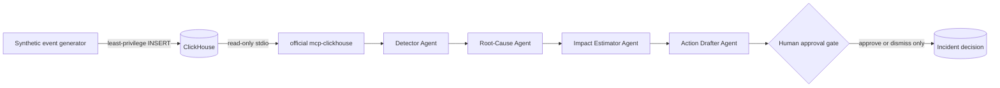

# WatchTower

WatchTower is human-governed incident intelligence for streaming operations. It watches live,
synthetic delivery telemetry in ClickHouse, detects material deviations, investigates the likely
cause, quantifies viewer and revenue impact, and drafts a reversible response for a person to
approve or dismiss.

Built from scratch for **Agentic Cinema: The Blockbuster Hackathon — ClickHouse Track**.

> WatchTower never executes an operational recommendation. Approval records a human decision;
> it does not call a CDN, ad platform, or playback system.

## Why it is different

- **Continuous, not conversational:** monitoring runs as an event-gated operations loop.
- **Evidence before prose:** anomaly detection and impact math are deterministic and auditable.
- **Real partner path:** analytics queries execute through the official `mcp-clickhouse` server.
- **Four real ADK agents:** Detector → Root-Cause → Impact Estimator → Action Drafter.
- **Quantified impact:** every incident includes viewer-hours, affected sessions, and USD impact.
- **Human control:** the action agent has no execution tools; every brief waits for a decision.
- **Original media data:** all 12 titles, descriptions, telemetry, and gradient covers are fictional.

## Runtime architecture



The ingestion identity can `SELECT`/`INSERT` only. The separate MCP identity can `SELECT` only.
The in-process MCP middleware additionally blocks mutations, comments, multiple statements,
unbounded results, and access outside the WatchTower tables. The MCP endpoint is stdio inside the
container and is never exposed to the network.

See [docs/ARCHITECTURE.md](docs/ARCHITECTURE.md) for the detailed data and trust model.

## Quick start

Prerequisites: Docker Desktop and Docker Compose.

```bash
docker compose up --build
```

Open <http://localhost:8080>. The compose stack creates a local ClickHouse service, two scoped
users, schema, historical baseline, and the web application. Local telemetry works without an AI
credential. To run Gemini-backed incident narration locally, authenticate Application Default
Credentials and keep `GOOGLE_CLOUD_PROJECT=watchtower-507216`.

Enter `local-demo-only` under Operator access before injecting an incident or recording a human
decision. This credential is strictly for the loopback-only local demo. Production always requires
a separately generated `WATCHTOWER_ADMIN_TOKEN` supplied through Secret Manager.

### Python development

```powershell
python -m venv .venv
.\.venv\Scripts\python.exe -m pip install -e '.[dev]'
docker compose up -d clickhouse
.\.venv\Scripts\uvicorn.exe watchtower.api:app --reload
```

Copy `.env.example` to `.env` and use the local credentials from `docker-compose.yml`.

## Verification

Fast quality gate (no external services):

```powershell
.\.venv\Scripts\ruff.exe format --check watchtower tests
.\.venv\Scripts\ruff.exe check watchtower tests
.\.venv\Scripts\python.exe -m pytest --cov=watchtower
```

Real ClickHouse + official MCP integration (requires the local ClickHouse container):

```powershell
.\.venv\Scripts\python.exe -m pytest tests/test_clickhouse_integration.py -m integration -vv
```

The integration test proves:

1. synthetic events are written to real ClickHouse;
2. detection and root-cause queries run through official `mcp-clickhouse`;
3. the planted CDN anomaly becomes a pending incident; and
4. a destructive query is rejected.

## Configuration

| Variable | Purpose | Production rule |
|---|---|---|
| `GOOGLE_CLOUD_PROJECT` | Vertex AI project | Must equal `watchtower-507216` |
| `GOOGLE_CLOUD_LOCATION` | Vertex AI / Cloud Run region | `us-central1` by default |
| `WATCHTOWER_AGENT_MODEL` | ADK Gemini model | `gemini-2.5-flash` |
| `WATCHTOWER_ADMIN_TOKEN` | Protects injection and decisions | Required; store in Secret Manager |
| `WATCHTOWER_BOOTSTRAP_SCHEMA` | Allows schema creation | Must be `false` in production |
| `CLICKHOUSE_USER/PASSWORD` | Ingestion and incident identity | Scoped `SELECT, INSERT` |
| `CLICKHOUSE_MCP_USER/PASSWORD` | Official MCP identity | Scoped `SELECT` only |
| `CLICKHOUSE_SECURE/VERIFY` | Database transport security | Both must be `true` |

No secret belongs in the repository, container image, or Cloud Run environment as plain text.

## Cloud Run profile

The intended service profile is deliberately cost-constrained:

- project: `watchtower-507216` only;
- region: `us-central1`;
- request-based billing, minimum instances `0`;
- maximum instances `1`, concurrency `20`;
- 1 vCPU / 512 MiB;
- ClickHouse and operator credentials from Secret Manager;
- a dedicated runtime service account with Vertex AI User and secret accessor only.

Deployment is blocked by configuration validation if another Google Cloud project is supplied,
Vertex AI is disabled, ClickHouse TLS verification is off, the operator token is absent, or the
runtime identity is allowed to create schema.

## Cost guardrails

The Google Cloud project has a project-scoped **$80 gross-cost budget** beginning August 31, 2026,
with current-spend alerts at **$25, $50, $75, and $80**. Credits are excluded from the calculation,
so alerts reflect resource cost rather than hiding it behind promotional credit. Budget alerts do
not themselves stop services; WatchTower therefore also uses scale-to-zero and a one-instance cap.

No payment method, billing link, or unrelated project is modified by this repository.

## Demo and submission material

- [Three-minute demo runbook](docs/DEMO_SCRIPT.md)
- [Devpost submission copy](docs/DEVPOST_SUBMISSION.md)
- [Implementation and trust architecture](docs/ARCHITECTURE.md)
- [Guarded Cloud Run deployment](docs/DEPLOYMENT.md)
- [Current project report](PROJECT_REPORT.md)

## Transparency

Telemetry is synthetic because private streaming-platform operational data is not available for a
public hackathon. Detection, correlation, impact estimation, MCP access, ADK orchestration, and the
human decision boundary are real. The dashboard labels the catalog as fictional and never uses a
real title, poster, studio asset, or media database.

## License

[MIT](LICENSE) © 2026 Ziyad Azzaz.
